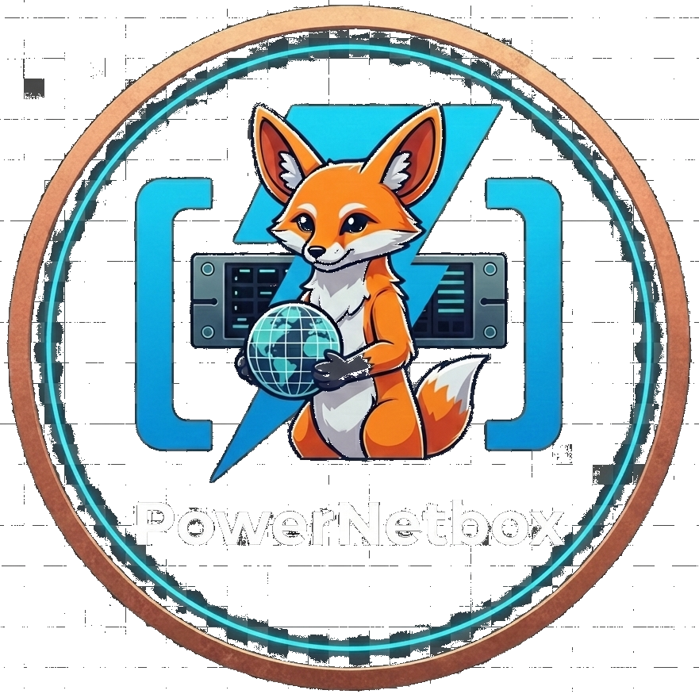

<p align="center">
  
</p>

<h1 align="center">PowerNetbox</h1>

<p align="center">
  <a href="https://www.powershellgallery.com/packages/PowerNetbox"></a>
  <a href="https://www.powershellgallery.com/packages/PowerNetbox"></a>
  <a href="https://github.com/ctrl-alt-automate/PowerNetbox/actions/workflows/test.yml"></a>
  <a href="https://github.com/ctrl-alt-automate/PowerNetbox/actions/workflows/integration.yml"></a>
  <br>
  <a href="LICENSE"></a>
  <a href="https://github.com/ctrl-alt-automate/PowerNetbox/actions/workflows/pssa.yml"></a>
  <a href="https://github.com/netbox-community/netbox"></a>
</p>

<p align="center">
  <b>The</b> comprehensive PowerShell module for the <a href="https://github.com/netbox-community/netbox">Netbox</a> REST API with <b>100% coverage</b>.<br>
  Fully compatible with <b>Netbox 4.5.0</b>.
</p>

---

## Acknowledgements

This project is a fork of the original **[NetboxPS](https://github.com/benclaussen/NetboxPS)** created by **[Ben Claussen](https://github.com/benclaussen)**.

We extend our sincere thanks to Ben and all original contributors for building the foundation of this module. Their work made PowerNetbox possible.

| | |
|---|---|
| **Original Author** | [Ben Claussen](https://github.com/benclaussen) |
| **Original Repository** | [benclaussen/NetboxPS](https://github.com/benclaussen/NetboxPS) |
| **License** | MIT (preserved from original) |

---

## Features

- **100% API Coverage** - Full support for all Netbox 4.x API endpoints
- **Cross-Platform** - Works on Windows, Linux, and macOS
- **524 Functions** - Complete CRUD operations for all resources
- **Pipeline Support** - Full PowerShell pipeline integration
- **Performance Optimized** - Brief mode, field selection, config_context exclusion
- **Secure** - Token-based authentication with TLS 1.2/1.3
- **Well Tested** - 1436 unit tests + 98 integration tests
- **Tab Completion** - Argument completers for common parameters
- **Verbose Logging** - Write-Verbose in all functions for debugging

### Supported Modules

| Module | Endpoints | Functions | Status |
|--------|-----------|-----------|--------|
| DCIM | 45 | 180 | ✅ Full |
| IPAM | 18 | 72 | ✅ Full |
| Virtualization | 5 | 20 | ✅ Full |
| Circuits | 11 | 44 | ✅ Full |
| Tenancy | 5 | 20 | ✅ Full |
| VPN | 10 | 40 | ✅ Full |
| Wireless | 3 | 12 | ✅ Full |
| Extras | 12 | 45 | ✅ Full |
| Core | 5 | 8 | ✅ Full |
| Users | 6 | 24 | ✅ Full |
| Branching* | 3 | 16 | ✅ Full |

\* Requires [netbox-branching](https://github.com/netboxlabs/netbox-branching) plugin

## Installation

### From PowerShell Gallery (Recommended)

```powershell
# Install for current user
Install-Module -Name PowerNetbox -Scope CurrentUser

# Install system-wide (requires admin/root)
Install-Module -Name PowerNetbox -Scope AllUsers
```

### Platform-Specific Instructions

#### Windows

```powershell
# PowerShell 5.1 (Windows PowerShell)
Install-Module -Name PowerNetbox -Scope CurrentUser

# PowerShell 7+ (recommended)
pwsh -Command "Install-Module -Name PowerNetbox -Scope CurrentUser"
```

#### macOS

```bash
# Install PowerShell 7 via Homebrew
brew install powershell/tap/powershell

# Install PowerNetbox
pwsh -Command "Install-Module -Name PowerNetbox -Scope CurrentUser"
```

#### Linux (Ubuntu/Debian)

```bash
# Install PowerShell 7
sudo apt-get update
sudo apt-get install -y wget apt-transport-https software-properties-common
wget -q "https://packages.microsoft.com/config/ubuntu/$(lsb_release -rs)/packages-microsoft-prod.deb"
sudo dpkg -i packages-microsoft-prod.deb
sudo apt-get update
sudo apt-get install -y powershell

# Install PowerNetbox
pwsh -Command "Install-Module -Name PowerNetbox -Scope CurrentUser"
```

### Manual Installation

```powershell
# Clone the repository
git clone https://github.com/ctrl-alt-automate/PowerNetbox.git
cd PowerNetbox

# Build the module
./deploy.ps1 -Environment prod -SkipVersion

# Import the module
Import-Module ./PowerNetbox/PowerNetbox.psd1
```

## Quick Start

### Connect to Netbox

```powershell
# Import the module
Import-Module PowerNetbox

# Connect with API token
$credential = Get-Credential -UserName 'api' -Message 'Enter your Netbox API token'
Connect-NBAPI -Hostname 'netbox.example.com' -Credential $credential

# Or connect with self-signed certificate
Connect-NBAPI -Hostname 'netbox.local' -Credential $credential -SkipCertificateCheck
```

### Basic Examples

```powershell
# Get all devices (config_context excluded by default for performance)
Get-NBDCIMDevice

# Get a specific device by name
Get-NBDCIMDevice -Name 'server01'

# Create a new IP address
New-NBIPAMAddress -Address '10.0.0.1/24' -Description 'Web Server'

# Update a device
Set-NBDCIMDevice -Id 1 -Description 'Updated description'

# Delete a device (with confirmation)
Remove-NBDCIMDevice -Id 1

# Pipeline support
Get-NBDCIMDevice -Name 'server*' | Set-NBDCIMDevice -Status 'active'
```

### Performance Optimization

PowerNetbox implements [NetBox REST API best practices](https://github.com/netboxlabs/netbox-best-practices) for optimal performance:

```powershell
# Brief mode - minimal response (~90% smaller payload)
# Returns only: id, url, display, name
Get-NBDCIMDevice -Brief

# Field selection - request only the fields you need
Get-NBDCIMDevice -Fields 'id','name','status','site.name'

# Config context is excluded by default (10-100x faster)
# Include it explicitly when needed:
Get-NBDCIMDevice -IncludeConfigContext

# Combine with filters for best performance
Get-NBDCIMDevice -Site_Id 1 -Status 'active' -Brief
```

| Parameter | Effect | Use Case |
|-----------|--------|----------|
| `-Brief` | ~90% smaller response | Dropdowns, reference lists |
| `-Fields` | Custom field selection | Reports, specific data needs |
| `-IncludeConfigContext` | Include config_context | When you need rendered config |

> **Note:** The `-Query` parameter performs a broad search and can be slow on large datasets. Use specific filters like `-Name`, `-Site_Id`, etc. for better performance.

### Advanced Examples

```powershell
# Create a VM with interface and IP
$vm = New-NBVirtualMachine -Name 'web-server-01' -Cluster 1 -Status 'active'
$interface = New-NBVirtualMachineInterface -Name 'eth0' -Virtual_Machine $vm.id
$ip = New-NBIPAMAddress -Address '192.168.1.100/24'
Set-NBIPAMAddress -Id $ip.id -Assigned_Object_Type 'virtualization.vminterface' -Assigned_Object_Id $interface.id

# Bulk operations with pipeline
Import-Csv devices.csv | ForEach-Object {
    New-NBDCIMDevice -Name $_.Name -Device_Type $_.Type -Site $_.Site
}

# Query with filters
Get-NBIPAMAddress -Status 'active' -Tenant 1 -Limit 100
```

### Branching Support (Plugin Required)

PowerNetbox supports the [netbox-branching](https://github.com/netboxlabs/netbox-branching) plugin for staging changes:

```powershell
# Check if branching is available
Test-NBBranchingAvailable

# Create a new branch
New-NBBranch -Name "feature/new-datacenter" -Description "Planning new DC"

# Enter branch context - all subsequent operations work in this branch
Enter-NBBranch -Name "feature/new-datacenter"
    New-NBDCIMSite -Name "DC-New" -Slug "dc-new"
    New-NBDCIMDevice -Name "server01" -DeviceType 1 -Site 1
Exit-NBBranch

# Or use Invoke-NBInBranch for exception-safe execution
Invoke-NBInBranch -Branch "staging" -ScriptBlock {
    Set-NBDCIMDevice -Id 1 -Status "planned"
    New-NBIPAMAddress -Address "10.0.0.1/24"
}

# Review changes in a branch
Get-NBChangeDiff -Branch_Id 1

# Sync branch with latest main
Sync-NBBranch -Id 1

# Merge changes to main
Merge-NBBranch -Id 1

# Revert a merge if needed
Undo-NBBranchMerge -Id 1
```

## Migrating from NetboxPS / NetboxPSv4

If you're migrating from the original NetboxPS or NetboxPSv4 module:

```powershell
# Remove old module
Remove-Module NetboxPS, NetboxPSv4 -Force -ErrorAction SilentlyContinue
Uninstall-Module NetboxPS, NetboxPSv4 -Force -ErrorAction SilentlyContinue

# Install PowerNetbox
Install-Module -Name PowerNetbox -Scope CurrentUser

# Import new module
Import-Module PowerNetbox
```

**All function names remain the same** (`Get-NBDCIMDevice`, `New-NBIPAMAddress`, etc.), so your existing scripts should work without modification.

## Documentation

- **[Documentation](docs/README.md)** - Getting started, examples, and troubleshooting
- **[Netbox API Docs](https://netbox.readthedocs.io/en/stable/rest-api/overview/)** - Official Netbox API documentation
- **[GitHub Issues](https://github.com/ctrl-alt-automate/PowerNetbox/issues)** - Report bugs or request features

### Guides

| Guide | Description |
|-------|-------------|
| [Getting Started](docs/guides/Getting-Started.md) | Installation and first steps |
| [Common Workflows](docs/guides/Common-Workflows.md) | Bulk import, VMware sync, reporting |
| [Bulk Operations](docs/guides/Bulk-Operations.md) | High-performance batch processing |
| [DCIM Examples](docs/guides/DCIM-Examples.md) | Sites, devices, racks, cables |
| [IPAM Examples](docs/guides/IPAM-Examples.md) | IP addresses, prefixes, VLANs |
| [Branching](docs/guides/Branching.md) | Stage changes with branching plugin |
| [Compatibility](docs/guides/Compatibility.md) | Netbox version support matrix |
| [Troubleshooting](docs/guides/Troubleshooting.md) | Common issues and solutions |

### Architecture

| Document | Description |
|----------|-------------|
| [Architecture Overview](docs/CODEMAPS/INDEX.md) | Module structure and design |
| [Functions by Module](docs/CODEMAPS/Functions.md) | Complete function reference |
| [Helper Functions](docs/CODEMAPS/Helpers.md) | Internal utilities |

## Requirements

| Platform | Minimum Version |
|----------|----------------|
| PowerShell Desktop | 5.1 |
| PowerShell Core | 7.0+ |
| Netbox | 4.1+ (tested with 4.5.0) |

> **Version Compatibility:** See the [Compatibility Guide](docs/guides/Compatibility.md) for detailed information about supported Netbox versions and API differences.

### Platform Support

| OS | PowerShell 5.1 | PowerShell 7+ |
|----|----------------|---------------|
| Windows 10/11 | ✅ | ✅ |
| Windows Server | ✅ | ✅ |
| macOS | N/A | ✅ |
| Linux | N/A | ✅ |

## Contributing

We welcome contributions! Please follow these guidelines:

1. Fork the repository
2. Create a feature branch from `dev`
3. Follow [PowerShell Practice and Style Guidelines](https://poshcode.gitbook.io/powershell-practice-and-style/)
4. Submit a pull request against the `dev` branch

## License

This project is licensed under the MIT License - see the [LICENSE](LICENSE) file for details.

Original copyright (c) 2018 Ben Claussen. Fork maintained by ctrl-alt-automate.

## Changelog

### v4.5.0.3

- **VPN/Wireless Pagination** - Added `-All` and `-PageSize` parameters to 12 VPN and Wireless Get- functions for automatic pagination (#250)
  - VPN: `Get-NBVPNTunnel`, `Get-NBVPNTunnelGroup`, `Get-NBVPNTunnelTermination`, `Get-NBVPNIKEPolicy`, `Get-NBVPNIKEProposal`, `Get-NBVPNIPSecPolicy`, `Get-NBVPNIPSecProfile`, `Get-NBVPNIPSecProposal`, `Get-NBVPNL2VPN`, `Get-NBVPNL2VPNTermination`
  - Wireless: `Get-NBWirelessLAN`, `Get-NBWirelessLANGroup`, `Get-NBWirelessLink`
- **Removed Form_Factor Parameter** - Removed obsolete `Form_Factor` parameter from interface functions (#252)
  - Removed from `Get-NBDCIMInterface`, `New-NBDCIMInterface`, `Set-NBDCIMInterface`
  - Use `-Type` parameter instead (e.g., `1000base-t`, `virtual`, `lag`)
- **Strong Parameter Typing** - Added ValidateSet attributes for stricter parameter validation (#248)
- **Input Validation** - Added URL segment validation in BuildNewURI helper (#247)
- **Security Fixes** - Verbose logging redacts sensitive fields, SecureString for webhook secrets (#234)

### v4.5.0.2

- **Bug Fix: PowerShell Core 7.x Error Messages** - Fixed issue where API error messages were not displayed correctly in PowerShell Core 7.x (#164)
  - Error details now correctly extracted from `ErrorDetails.Message`
  - Fallback to `Exception.Response` for Windows PowerShell 5.1 compatibility
  - Improved JSON/HTML error parsing logic

### v4.5.0.1

- **Performance Optimization** - Implements [NetBox REST API best practices](https://github.com/netboxlabs/netbox-best-practices)
  - `-Brief` switch on all GET functions (~90% smaller responses)
  - `-Fields` parameter for custom field selection
  - `config_context` excluded by default (10-100x faster for device/VM queries)
  - `-IncludeConfigContext` switch to opt-in when needed
  - Warning when using `-Query` parameter (slow on large datasets)
- **VPN Function Improvements** - Fixed verbose messages and code formatting
- **524 public functions** with 100% API coverage
- **1436 unit tests, 98 integration tests**

### v4.5.0.0

- **Full Netbox 4.5.0 compatibility** - Tested with official 4.5.0 release
- **Token v2 Bearer authentication** - Support for new `nbt_<KEY>.<TOKEN>` format
- **Cable Profiles** - `Cable_Profile` parameter on cable functions
- **Object Ownership** - New `Get/New/Set/Remove-NBOwner` and `*-NBOwnerGroup` functions
- **Test-NBAuthentication** - New function for auth verification
- **Port Mappings** - Bidirectional `rear_ports`/`front_ports` support
- **New fields** - `start_on_boot`, `enabled`, `color` on various endpoints
- **Is_Staff deprecation** - Automatically handled for User functions
- **506 public functions** with 100% API coverage
- **952 unit tests, 94 integration tests**

### v4.4.10.0

- **Full Netbox 4.4.10 compatibility** - Tested with latest stable release
- **New bridge_interfaces field** - Interface API now returns reverse bridge relationships (read-only)
- **498 public functions** with 100% API coverage

### v4.4.9.3

- **Bulk operations resilience** - Automatic fallback to sequential requests on 500 errors
- **PowerShell 7.4+ compatibility** - Fixed redirect handling in `Connect-NBAPI`
- **Pipeline binding fix** - `Set-NBIPAMAddress` now accepts Status/Description from pipeline
- **Scenario test suite** - Comprehensive tests for bulk operations, workflows, and filters

### v4.4.9.2

- **Argument completers** - Tab completion for common parameters (#115, #117)
- **Verbose logging** - Write-Verbose added to all 448 functions (#121)
- **Documentation cleanup** - Removed placeholder documentation (#116)
- **Test suite improvements** - Comprehensive integration tests for Circuits, VPN, Wireless, Extras (#128)
- **Bug fixes** - Bulk mode parameter binding, parameter naming standardization (#118, #120)
- **Code quality** - PSScriptAnalyzer compliance, quality audit fixes (#126)

### v4.4.9.1

- **Cross-platform error handling** - Fixed type casting error on PowerShell Core 7.x (#100)
- **Central version parsing** - New `ConvertTo-NetboxVersion` helper for consistent version detection (#111)
- **Improved compatibility** - Handles Docker-suffixed versions like `4.2.9-Docker-3.2.1`
- **952 unit tests** - Added tests for version parsing and error handling

### v4.4.9.0

- **Full Netbox 4.4.9 compatibility** - Tested with latest stable release
- **Docker-based integration testing** - 79 live API tests against real Netbox
- **946 unit tests** across all platforms
- **494 public functions** with 100% API coverage

### v4.4.8.2

- Docker-based CI/CD integration testing
- Documentation updates

### v4.4.8.1

- New versioning: `Major.Minor.Patch.ModulePatch` (first 3 digits = Netbox version)
- PowerShell 5.1 compatibility fix for `Remove-NBDCIMSite`
- SecureString support for password parameters in User functions
- Code quality improvements (OutputType, ValidateNotNullOrEmpty)

### v4.4.8

- **Initial PowerNetbox release** (fork of NetboxPS)
- **100% API coverage** for Netbox 4.4.8
- **478 public functions** across all modules
- **613 unit tests** for quality assurance
- **Cross-platform support** - Windows, Linux, macOS
- New modules: VPN, Wireless, Core, Users
- All function names unchanged for backwards compatibility
